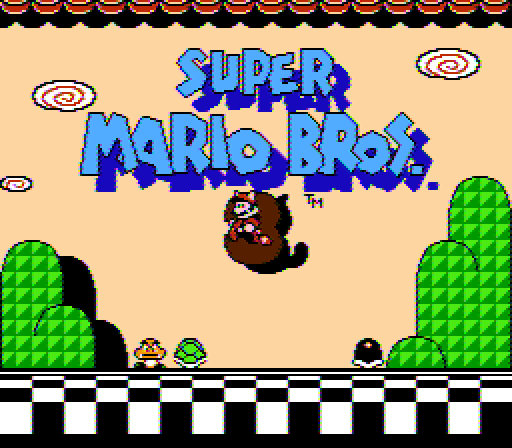
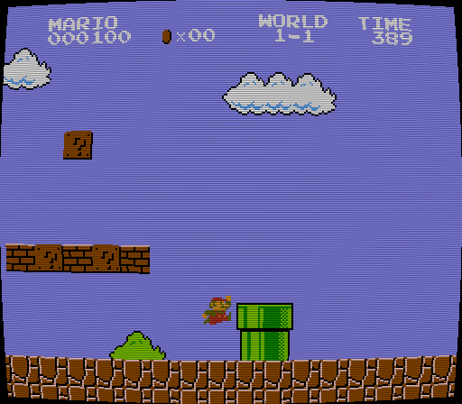
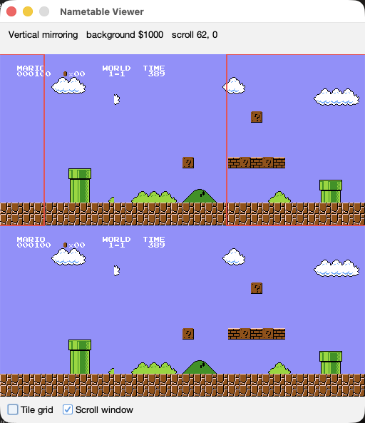
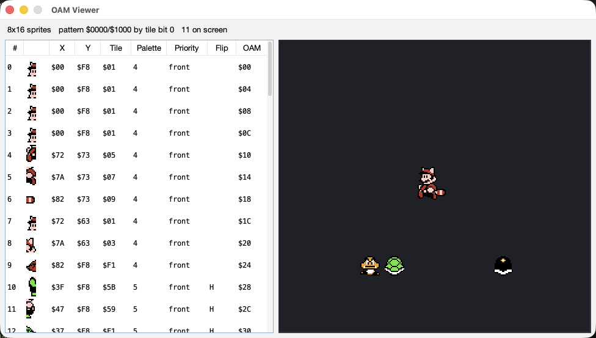
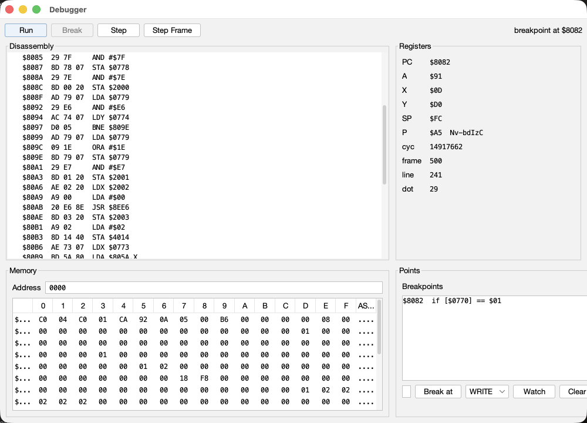

# MyNES

A NES emulator written in Java. Still a work in progress, but it plays games.


## Download

Grab the zip from the [releases page](https://github.com/dimiro1/mynes/releases), unpack it, and
run the launcher:

```sh
unzip mynes-0.3.0.zip
cd mynes-0.3.0
./mynes            # or mynes.bat on Windows, or: java -jar mynes.jar
```

The same zip works on macOS, Windows and Linux. You need Java 25 —
[Adoptium](https://adoptium.net) has builds for everything.

Then **File > Open...** and pick a `.nes` file. No ROMs are included, so bring your own.

## Controls

| NES button | Key |
|---|---|
| D-pad | Arrow keys |
| A | X |
| B | Z |
| Start | Enter |
| Select | Shift |
| Quick Save | F5 |
| Quick Load | F7 |
| Rewind (hold) | Backspace |
| Screenshot | F12 |
| Copy Screenshot | Cmd/Ctrl+F12 |

Remap anything under **Settings > Controller...** — click a button, press a key, done. Everything
lands in `~/.mynes/config.properties`, which you can also edit by hand:

```properties
video.palette=nesdev
video.scale=2
emulation.fast-forward=4x
rewind.seconds=30
controller1.a=VK_X
```

Key names are the `VK_` constants from `java.awt.event.KeyEvent`. `rewind.seconds=0` switches
rewind off — that one has no menu item, so the file is where it lives.

## What works

**Emulation**

- Cycle-accurate CPU and dot-by-dot PPU, including the obscure corners: sprite 0 hit, the sprite
  overflow bug, open bus decay, OAM decay, colour emphasis.
- The complete APU — both pulses, triangle, noise and DMC — mixed through the hardware's nonlinear
  ladders and played at 44.1 kHz.
- NTSC and PAL, as the genuinely different machines they are. Most ROM headers don't say which
  region they want, so **Machine > Region** lets you insist. A game running 17% fast with the
  music too high is a game that wants PAL.
- Eleven mappers: NROM, MMC1, UxROM, CNROM, MMC3 (0–4), AxROM (7), MMC2 and MMC4 (9, 10),
  Color Dreams (11), GxROM (66) and Camerica (71).

**Video**

- Twelve palettes — the NESdev set, ten measured NTSC palettes from firebrandx.com, and one for
  PAL. **Settings > Palette...** previews them live over the running game.
- An NTSC filter that rebuilds and decodes the chip's composite signal instead of using a palette,
  which is where colour bleed, dot crawl and artefact colours come from. Three strengths, NTSC
  machines only.
- A CRT filter that draws the scanline gaps a 240-line picture left on a 480-line tube, with
  optional curved glass. Works on either region; needs at least 2x scale.
- Whole-number scaling from 1x to 4x, with free window resizing on top.
- Screenshots to a PNG beside the ROM (`F12`) or straight to the clipboard (`Cmd/Ctrl+F12`).
- A status bar showing the real frame rate and any setting that isn't the default one.

**Playing**

- Save states, nine slots per game, `F5`/`F7` for the current slot.
- Battery saves in the standard `.sav` format, interchangeable with FCEUX, Nestopia and Mesen.
- Rewind — hold Backspace and the game runs backwards, sound and all, up to thirty seconds. Let go
  and it plays on from there.
- Fast forward at 2x, 4x, 8x or unlimited.
- Movie recording and playback, from the Machine menu. A movie stores the buttons rather than the
  video, so it is a few kilobytes a minute and replays byte for byte.
- IPS patches via **File > Open with Patch...**. The patch is applied in memory, the ROM on disk
  is never touched, and a patched game keeps its own saves.
- The last ten games you opened, under **File > Open Recent**. One opened with a patch comes back
  patched, and anything whose file has moved is greyed out rather than dropped.
- Game Genie codes from the **Hacks** menu. Nothing is patched — the codes answer the bus the way
  the real device did.

**Hacks**

- **Unlimited Sprites** draws the sprites the hardware would have dropped, so busy scanlines stop
  flickering. The game can't tell.
- **Overclock** gives the game extra idle scanlines each frame, which fixes the slowdown in games
  like Super Mario Bros. 3 and Gradius. The picture and the music are unaffected.

**Debugging**

- A debugger with breakpoints (conditions included, like `$C000 if a == $10`), read/write
  watchpoints, single stepping, a live disassembly and a hex view of the address space.
- CPU tracing in nestest's log format, so a trace diffs cleanly against other emulators.
- A CHR viewer, a nametable viewer with the scroll window drawn over all four tables, and an OAM
  viewer showing all sixty-four sprites.
- Toggles to hide the background or the sprite layer.

Not there yet: a second player, and Dendy (run as PAL for now).

## Screenshots

### Super Mario Bros. (mapper 0, NROM)


### Tetris (mapper 1, MMC1)


### The NTSC filter

The picture decoded from the chip's composite signal rather than looked up in a palette, which is
where the colour fringes on the logo come from.



### The CRT filter

The palette's colours laid down between the lines of a 480-line raster, with the curved glass on.



### The palette picker

Every selection applies the moment it is made, so the game behind the dialog is the comparison.


### The nametable viewer

All four nametables, with the scroll window drawn over the two Super Mario Bros. is scrolling
between.



### The OAM viewer

All sixty-four sprites with their attributes, and where each one lands on the screen.



### The CHR viewer

A bank of Super Mario Bros. 3's character ROM.


### The debugger

Stopped on a conditional breakpoint at Super Mario Bros.' NMI handler.



### The controller dialog


### The Game Genie dialog

Each code is listed with what it actually does.


## Saving

Three kinds of file, all kept beside the ROM:

- **Save states** (`GAME.mn1`–`GAME.mn9`) freeze the whole console. They load in MyNES and
  nowhere else — no emulator's save states load anywhere else, there is no standard for them.
- **Battery saves** (`GAME.sav`) are the cartridge's own save RAM, in the raw format every major
  emulator reads and writes, so saves move between emulators freely. A save state is a bookmark;
  a `.sav` is fifty hours of Zelda, so it is written via a temporary file and a crash cannot take
  both the old save and the new.
- **Movies** (`.mnm`) record where the run started and what was pressed on each frame. The
  emulator is deterministic, so playback is exact, and a movie recorded from power on needs
  nothing but the same ROM.

## Headless mode

The emulator also runs without a window, for scripts, CI, or a machine with no display:

```sh
java -jar mynes.jar --headless --rom smb.nes --frames 900 \
    --input 60/40x3:start --screenshot 300,last --audio
```

That runs 900 frames, presses Start a few times to get past the title screen — most games never
start on their own — and writes screenshots, a WAV and a JSON report describing the run: a frame
hash, colour counts, how many frames showed motion. `--expect-not-blank`, `--expect-audio` and
`--expect-motion` turn those into pass/fail exit codes for scripting, and because runs are
deterministic, a frame hash makes a fair regression test.

There is also `--interactive`, a JSON-per-line REPL with the whole debugger in it: breakpoints,
watchpoints, stepping, disassembly, tracing, rewind, movies.

`--headless --help` lists every option, and [CLAUDE.md](CLAUDE.md) covers it all in detail. That
file is written for coding agents, but it is just as accurate for people.

## Building

You need Java 25 and Maven. Nothing else.

```sh
git clone https://github.com/dimiro1/mynes.git
cd mynes
mvn -q compile exec:exec        # run straight from source
```

Or build the jar once and run that:

```sh
mvn -B package -DskipTests
java -jar mynes-desktop/target/mynes.jar
```

Four Maven modules — `mynes-core` (the console, no dependencies), `mynes-patch` (IPS),
`mynes-headless` (the command line) and `mynes-desktop` (the window) — flattened into one jar.
The same `mvn package` also produces the release zip. A fifth, `mynes-shots`, takes the pictures
above and is not in the jar.

## Tests

```sh
mvn test
```

- **CPU:** all 256 opcodes against the
  [Tom Harte SingleStepTests](https://github.com/SingleStepTests/65x02), checking the end state
  and the exact per-cycle bus traffic, plus nestest. `./scripts/download-6502-tests.sh` fetches
  the full 10,000-cases-per-opcode set if you want it.
- **PPU and APU:** blargg's test ROM suites. Everything passes except `oam_stress`, which
  blargg's own readme says passes on only one of four random alignments on real hardware.
- **MMC3:** five of `mmc3-test-2`'s six ROMs, including the exact-dot scanline timing one. The
  sixth tests the revision A counter, and no real chip passes both.
- **The whole console:** [AccuracyCoin](https://github.com/100thCoin/AccuracyCoin) scores 139 of
  its 141 tests.


## Licence

MIT. See [LICENSE](LICENSE).
