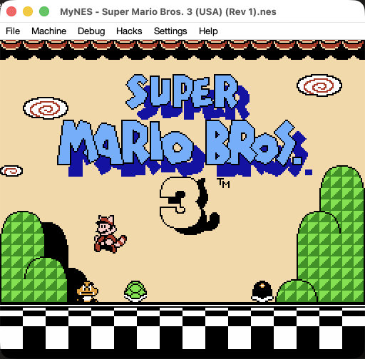
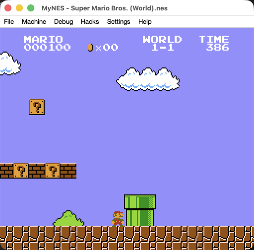
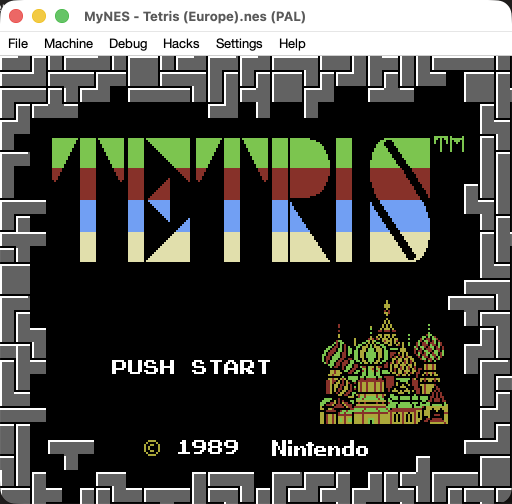
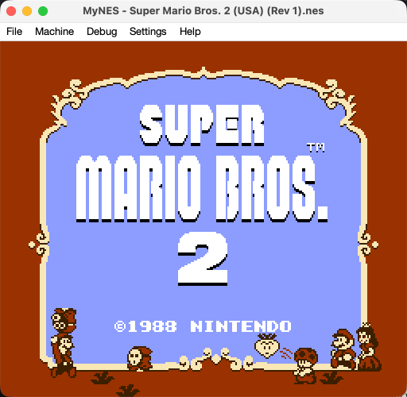
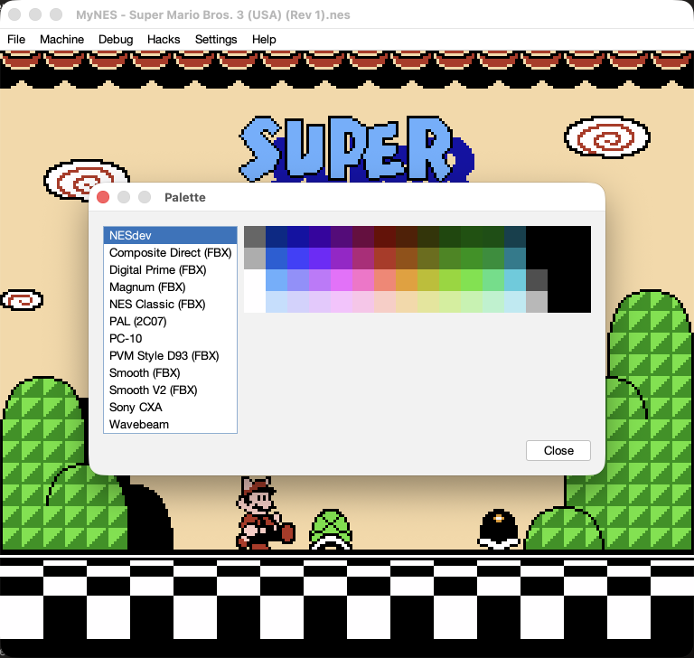
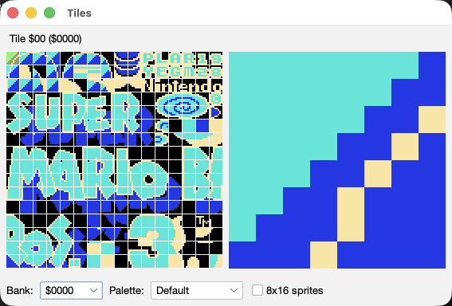
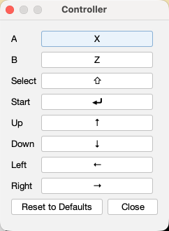
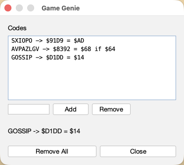
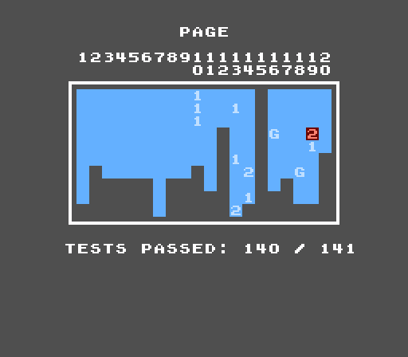

# MyNES

A NES emulator written in Java. Still a work in progress, but it plays games.



## Downloading it

There is a zip on the [releases page](https://github.com/dimiro1/mynes/releases). Unpack it and run
the script inside:

```sh
unzip mynes-0.2.0.zip
cd mynes-0.2.0
./mynes
```

`mynes.bat` is the same thing for Windows, and `mynes.jar` is what both of them run, so
`java -jar mynes.jar` works too, as does double clicking it. One zip covers macOS, Windows and
Linux: the libraries the emulator uses carry their native code for all three, and the jar carries
the libraries.

You still need Java 25. The zip holds the emulator and nothing else, so if you have not got one,
[Adoptium](https://adoptium.net) has one for every machine this runs on.

Then **File > Open...** and pick a `.nes` file. No ROMs are included, so bring your own. Games run at
60.0988 frames a second, or 50.0070 on a PAL cartridge, with the overscan cropped and the picture
scaled to the window.

## Building it

You need Java 25 and Maven. Nothing else.

```sh
git clone https://github.com/dimiro1/mynes.git
cd mynes
mvn -q compile exec:exec
```

That opens the window. Or build a jar once and run that:

```sh
mvn -B package -DskipTests
java -jar mynes-desktop/target/mynes.jar
```

One jar, whichever way: it is four Maven modules -- `mynes-core` for the console, `mynes-patch` for
IPS patches, `mynes-headless` for the command line, `mynes-desktop` for the window -- flattened into
one file with its dependencies. The core depends on nothing at all, which is the point of it being
separate, and neither does the patcher.

The same `mvn package` also writes the release zip into `mynes-desktop/target/`, so what the releases
page carries is never anything a build here has not already made.

## Controls

| NES button | Key |
|---|---|
| D-pad | Arrow keys |
| A | X |
| B | Z |
| Start | Enter |
| Select | Shift |
| Quick Save | F5 |
| Quick Load | F7 |
| Rewind (hold) | Backspace |
| Screenshot | F12 |

Rewind runs the game backwards through the last thirty seconds, sound and all, for as long as you
hold the key; let go and it plays on from there. Fast Forward applies while you hold it, so the two
together are a fast reverse.

**Settings > Controller...** remaps any of them. Click a button, press the key you want on it, and
that is it: there is no save button. Your choices land in `~/.mynes/config.properties`, along with
the palette, screen size, fast forward speed and how much rewind keeps:

```properties
video.palette=nesdev
video.palette.pal=2c07
video.filter=none
video.filter.strength=medium
video.scale=2
video.screenshot.scale=1
emulation.region=auto
emulation.fast-forward=4x
audio.muted=false
rewind.seconds=30
rewind.key=VK_BACK_SPACE
controller1.a=VK_X
controller1.left=VK_LEFT
```

`rewind.seconds=0` switches rewind off, which costs nothing at all; it is the one setting with no
menu item, so that file is where it is remapped.

You can edit that file by hand instead. Key names are the `VK_` constants from
`java.awt.event.KeyEvent`, and an empty value leaves a button unbound. Anything missing or
misspelled falls back to its default and says so in the log.

## What works

**The console.** The CPU runs cycle by cycle and the PPU dot by dot: background and sprite
pipelines, the loopy scroll registers, sprite 0 hit, the sprite overflow bug, the delayed $2006 VRAM
address, the write-ignore window the chip holds over $2000, $2001, $2005 and $2006 while it warms
up, open bus decay, OAM decay and colour emphasis. The PPU fills a 256x240 buffer with colour
*indices*; turning those into pixels is the palette's job, not the chip's.

**Sound.** The whole 2A03 APU: two pulses with their sweep units, the triangle, the noise channel,
and the DMC with its DMA, plus the frame counter and both of its interrupts. It is mixed through the
hardware's two nonlinear ladders, filtered the way the console's output stage is, and played at
44.1 kHz through `javax.sound.sampled`. A computer with no sound device runs silently and says so in
the log.

**Eleven mappers:** NROM, MMC1, UxROM, CNROM and MMC3 (0 to 4), the last of those with its
scanline IRQ; then AxROM (7), MMC2 and MMC4 (9 and 10), Color Dreams (11), GxROM (66) and the
Camerica boards (71). MMC2 and MMC4 are the odd ones: their pattern tables switch themselves from
whichever tile the PPU last fetched, with no code involved, which is how Punch-Out!! animates two
boxers out of far more tiles than fit in the window.

**Both consoles.** The NTSC machine and the PAL one, which are not the same machine at a different
speed: the PAL PPU draws 312 scanlines instead of 262 and takes 3.2 dots to a CPU cycle instead of
3, and every table in its APU counted in CPU cycles is a different table. The cartridge header is
believed where it says anything, which is not often — the field was an afterthought and most dumps
leave it blank — so **Machine > Region** is there to insist. A game running 17% fast with the music
too high is the symptom to reach for it over.

**Twelve palettes:** the NESdev set, ten measured NTSC ones from firebrandx.com — among them NES
Classic, PVM Style D93, Smooth and Wavebeam — and one for the PAL chip, whose colourburst sits
fifteen degrees away from the NTSC one and which therefore needs a table of its own. PAL cartridges
get that one by default. **Settings > Palette...** lists them next to a swatch grid and applies each
one as the selection moves, so you can compare them against the running game, or against a paused
frame; the choice is remembered separately for each kind of machine.

**An NTSC filter**, from **Settings > Video Filter**. A palette answers "what colour is entry $21"
one pixel at a time, which is the wrong shape of answer for the three things that depend on the
pixel next door: colour bleed, dot crawl, and the artefact colours a game gets by alternating narrow
columns of grey. This answers it the other way round. The chip does not encode RGB into composite --
it draws the waveform directly, out of twelve square waves at the colourburst rate -- so the filter
rebuilds that waveform and decodes it the way a receiver did, slew and all: the 2C02's output
impedance depends on the level it is driving, which rotates the hue of a colour with its row, and
leaving that out puts every colour about seven degrees away from every palette here. The palette is
not consulted while it is on, so **Settings > Palette...** is greyed out; and the filter is greyed
out itself on a PAL machine, whose 2C07 draws a different signal that would need a decoder of its
own. Nothing measured moves -- the frame hash and the colour counts are taken over the colour
indices the chip emits -- so it changes the picture and nothing else. `--filter ntsc` does the same
from the command line.

**Settings > Video Filter > Strength** says how soft it draws. Every receiver had to keep the
subcarrier out of luma, and the bluntest way to do it is to average a whole colour cycle -- which
takes every luma detail finer than that cycle down with the chroma, and is the whole of why a
decoded picture is softer than a palette's. A television with a proper trap in it did not pay that
price, so this is how much of the detail to give back: **Strong** is the bare average and the
softest of the three, **Low** is nearly as sharp as the palette and still bleeds its colours, and
**Medium** is where it starts. The colours do not move at any of them -- only the detail between
them. `--filter ntsc=low` does the same from the command line.

**Screen size** at 1x, 2x, 3x or 4x of the 256x224 picture, from **Settings > Screen Size**, which
packs the window around it. Whole multiples only, so every NES pixel comes out the same size as
every other one. You can still resize the window by hand, and the picture is fitted and letterboxed
to keep its shape; the menu is how to get back to a clean multiple.

**Screenshots** from **File > Screenshot**, or `F12`, which writes a PNG beside the ROM named after
it and stamped with the time — no dialog, since a picture that took one to save would be a picture
of the moment after the one worth keeping. **Settings > Screenshot Size** magnifies it by 1x to 4x
on the way out; 1x is the 256x224 the machine drew. It is the picture rather than the window: the
overscan is cropped the way the window crops it, the magnification is a whole number whatever size
the window has been dragged to, and it works on a machine that is paused or stopped at a breakpoint.

**A status bar** along the bottom, from **Settings > Status Bar**, which carries the things a window
cannot show you by being looked at: how many frames a second the machine is really getting through,
which console it is, and every setting that is not the ordinary one — the overclock as the
percentage the menu offered, how many Game Genie codes are in the slot, whether the sound is muted,
unlimited sprites, the NTSC filter, a screenshot size that is not 1x. It fits as many of those as
the window is wide enough for, in that order, and says how many it could not: `NTSC · Overclock
+50% · 3 Genie codes · +3 ⓘ`. Hovering gives the rest, and gives it in full — every setting,
including the ones nobody has touched, down to the palette in use and how many seconds of rewind are
being kept, which is the only place in the window that last one appears at all. Whatever the machine
is doing other than simply running — paused, recording, playing a movie back, fast forwarding — sits
at the right hand end. The rate is measured over a second and held where it is when a reading lands
within one frame of the last, because a frame counter is a whole number and a bar flickering between
60 and 61 would be reporting its own arithmetic rather than anything about the game. Ticking it off
takes the row off the window rather than out of the picture.

**Fast forward** at 2x, 4x, 8x or unlimited, from the Machine menu. The console is clocked exactly
as it always is. What shrinks is the wait between frames, and the display still shows sixty a
second, so you see the ones that fall due. Asking for more than the computer manages is not an
error; you simply get whatever it manages. Sound cannot be handed to a sound card faster than real
time, so audio comes out chopped rather than sped up.

**The rest of the Machine menu:** Reset (the console button, memory survives), Power Cycle, Region,
Pause and Mute. Changing the region starts the game again from power on, since the chips are built
around it and a running machine cannot be rewired. Mute is remembered between runs; fast forward is not. Muting does not tell the machine
anything, so a silenced APU still runs and still raises its interrupts, and a game behaves the same
either way.

**Debug tools.** A debugger stops the machine where you tell it to: breakpoints on an address,
watchpoints on a write, single stepping by instruction or by frame, a live disassembly with the
history of what actually ran above it, the registers and where the beam is, and a hex view of the
whole address space. A watchpoint says which instruction did the writing, which is the question
worth asking. It reads the machine only while it is stopped, so what it shows is one moment rather
than a blur of several.

A CHR viewer shows every tile of a bank with a zoomed preview, coloured with any of the eight
palettes the game is using, and it updates live as CHR RAM is rewritten and palettes change. There
are also toggles to hide the background or the sprite layer without the game noticing.

A **Hacks** menu, for the things the console does not do. **Unlimited Sprites** draws the sprites the
chip would have dropped, so a scanline holding more than eight of them stops flickering; the game
cannot tell, since the overflow flag still rises and the cartridge still sees the same address bus.
It is off unless it is ticked, and the tick is remembered.

**Overclock** is the other one, and it is not that kind of hack: it gives the game extra idle
scanlines a frame — +25%, +50%, +100% or +200% — so that a main loop which overruns its frame stops
dropping one, which is what the every-other-frame stutter in Super Mario Bros. 3 and Gradius under
load actually is. The picture is drawn exactly as the hardware draws it, and the music keeps its
pitch and tempo, because the sound chip stands still through the extra lines. But the game does get
more done between one frame and the next, so this is not the game as it shipped. It is remembered
like the tick above, and it is greyed out while a movie is recording or playing.

**Game Genie codes**, from **Hacks > Game Genie...**, which is the last thing in that menu and the
one thing in it the console really did do. Six letters or eight, from the sixteen a code is spelled
with; eight-letter codes carry a byte the cartridge has to answer with before they fire, which is
what pins one to a single bank. Nothing is patched — the device sat between the cartridge and the
console and answered the bus in its place, and so does this, which is why the cartridge's digest is
the same with codes in as without. They take effect as they are typed, they survive a power cycle,
and they are forgotten when another cartridge goes in, since a code written for one game is an
arbitrary byte written over the next. `--genie` does the same thing from the command line.

All of it is in headless mode too — `break`, `watch`, `step` and `disasm` are commands in the
interactive session, so the same questions can be asked from a script.

**IPS patches**, from **File > Open with Patch...**, which is how a romhack is handed out. The patch
is applied to the bytes on their way into the emulator, so the ROM on disk is left exactly as it was
and there is no patched copy of it to keep anywhere. A patched game keeps its own save states and
battery file, named after the patch rather than the ROM, so an afternoon with a hack cannot write
over fifty hours of the original. `--patch` does the same thing from the command line.

**Session recordings**, from **Machine > Record Movie...** and **Machine > Play Movie...**. A movie
is not a video: it is where the run started, one button mask per frame, and the frames Reset was
pressed at, which comes to a few hundred bytes a minute. Playing one back reproduces the session byte
for byte, because nothing in the machine reads a clock or a random number. Rewinding while recording
drops the frames you took back, so a movie holds the run you finally played rather than the one you
undid. `--record` and `--play` do the same from the command line.

**Save states and battery saves**, and a **headless mode** for running with no window at all. Both
have a section of their own below.

Not there yet: a second player, and Dendy, the Russian famiclone, which a cartridge that asks for it
gets run as PAL instead.

## Screenshots

### Super Mario Bros. (mapper 0, NROM)



### Tetris (mapper 1, MMC1)



### Super Mario Bros. 2 (mapper 4, MMC3)



### The palette picker

Every selection takes effect the moment it is made, so the picture behind the dialog is the
comparison. It recolours a paused frame just as well as a running one.



### The CHR viewer

A bank of Super Mario Bros. 3's character ROM, drawn with one of the eight palettes the game is
running with.



### The controller dialog



### The Game Genie dialog

Each code is listed with what it actually does, because six letters say nothing about themselves and
a mistyped one is a perfectly valid code for somewhere else entirely.



## Saving

There are two kinds of save file here, and they are not two versions of the same idea.

**Save states** are the whole console frozen to a file: every register, both RAMs, the palettes, the
half-executed instruction, where the beam is. **Machine > Save State** and **Machine > Load State**
each hold nine slots. `F5` and `F7` use the current slot, and picking a slot from either menu makes
it the current one. States live beside the ROM as `GAME.mn1` through `GAME.mn9`, and the Load State
menu labels each slot with the frame it was taken on and when.

They load in MyNES and nowhere else. There is no standard format for save states and there never has
been: cross-emulator states have been proposed on NESdev more than once and abandoned every time,
because every emulator models the pipeline differently and there are hundreds of mappers. A state
taken from one cartridge is refused by another.

**Battery saves** are the eight kilobytes a coin cell kept alive on the cartridge, and this format
*is* standard: `GAME.sav`, raw bytes, no header, no version. FCEUX, Nestopia and Mesen all read and
write exactly this, so a save from any of them can be dropped next to the ROM and it just works.
MyNES reads it when the cartridge loads, and writes it when the window closes, when the cartridge
changes, and once a minute if the game has saved anything since. Only cartridges whose header claims
a battery get one. The RAM at $6000 that a test ROM prints its results through is scratch, and
persisting it would invent saves nobody made.

The difference is worth keeping in mind. A save state is a bookmark, and losing one costs a few
minutes. A `.sav` is fifty hours of Zelda, which is why that one is written to a temporary file and
moved into place, so that a crash halfway through cannot take both it and its replacement.

**Movies** are the third file here and the odd one out, because they hold no picture of the machine
at all. A `.mnm` is where the run started, one byte per frame saying what was held down, and a list
of the frames Reset was pressed at -- ninety seconds of play is about five kilobytes before it is
compressed. It can be that small only because the console is deterministic: the same cartridge given
the same buttons on the same frames arrives at the same bytes, so playing one back reproduces the
session exactly rather than approximately.

Recording from power on carries no state at all, which makes a movie of a whole playthrough something
you can hand to anybody with the same ROM. Starting one part way through puts a save state inside the
file to begin from, since there is otherwise nothing to say where the beginning was. Game Genie codes
travel inside the movie and are put back on playback -- they have to, because a cheated cartridge is
byte for byte an honest one and nothing else in the file could say so.

Rewinding while recording drops the frames you took back rather than appending them, so a movie is
the timeline you finally played and a replay never re-enacts the revert. Power Cycle and Region are
greyed out while a movie is running, since both build a new machine and the recording would go with
it.

## Headless mode

The emulator also runs with nobody watching: no window, no sound card. That is useful from a script,
on a machine with no display, or for a coding agent that cannot look at a window.

```sh
mvn -B package -DskipTests
java -jar mynes-desktop/target/mynes.jar --headless \
    --rom smb.nes --frames 900 --input 60/40x3:start --screenshot 300,last --audio
```

That runs 900 frames, presses Start to get past the title screen, and writes two PNGs, a JSON report
and a WAV into `target/headless`. Maven can run it too, and is shorter to type if you only need it
once:

```sh
mvn -q compile exec:exec@headless -Dmynes.args="--rom smb.nes --frames 900 --screenshot last"
```

The jar is worth building for anything you run more than a few times: Maven takes a couple of
seconds to start up, the jar about a third of one.

`--headless --help` lists every option. The things worth knowing before you read it:

- **Most games never start on their own.** Super Mario Bros., Super Mario Bros. 3 and Tetris all sit
  on their title screens for as long as anyone cares to wait, drawing the same picture and writing
  nothing to the sound registers. Only Super Mario Bros. 2 plays untouched. `--input 60/40x3:start`
  presses Start on frame 60 and twice more, which gets all four into their first level. The `x3`
  matters: Start is also the pause button.
- **The report describes the picture** for anything that cannot look at it: a hash of the visible
  224 lines, how many colours are in the frame, whether it is one flat colour, and how many frames
  differed from the frame before. That last number is the one that catches a game stuck on its menu.
- **`--expect-not-blank`, `--expect-audio` and `--expect-motion N`** turn three of those questions
  into a pass or a fail. The run exits 4 when they do not hold, which is what a script wants.
- **Runs are deterministic.** Nothing in the machine reads a clock or a random number, so the same
  ROM, input and frame count produce identical bytes on every run and every computer. Anything that
  legitimately varies lives under `host` in the report, so
  `diff <(jq 'del(.host)' a.json) <(jq 'del(.host)' b.json)` compares two runs.
- **`--filter ntsc`** colours the picture by decoding the composite signal the chip drew instead of
  looking each pixel up in a palette, which is where colour bleed, dot crawl and artefact colours
  come from. It bypasses `--palette`, and it is refused on a PAL machine. Unlike everything else in
  this list it does **not** join the things to check before diffing two runs: everything the report
  measures is taken over colour indices, so `video.finalFrame` is identical with it on and off and
  only the PNGs differ. `--filter ntsc=low`, `=medium` or `=strong` says how much of the fine detail
  the decoder's chroma trap costs to give back; `filter` is a command in the interactive session
  too, and takes the strength as a second word.
- **`--region ntsc|pal`** overrides what the cartridge's header asks for. Two runs in different
  regions are not two measurements of the same thing — a frame is 106392 dots on one machine and
  89342 on the other — so `run.region` in the report is part of what to check before diffing them.
- **`--save-state` and `--load-state`** cut the wait when the same two hundred frames of title
  screen are in the way of every run. `--sram-in` and `--sram-out` do the same for battery RAM, in
  the `.sav` format other emulators read.
- **`--patch`** applies an IPS patch to the ROM before it is read as a cartridge, so a romhack can be
  run without a patched file existing anywhere. The report's `cart.patches` says how many records
  each one held, and `cart.sha256` is the digest of the patched image rather than the file on disk —
  a patch that turns out to hold no records is one cut against a different dump of the game.
- **`--hack NAME`** switches on one of the things the console does not do, all of which are off
  otherwise, and `run.hacks` in the report is part of what to check before diffing two runs. There
  are two. `unlimited-sprites` draws the sprites the chip would have dropped so that a scanline
  holding more than eight of them stops flickering; nothing a game can observe changes — the
  overflow flag still rises and the cartridge sees the same address bus — but the picture is not the
  one the hardware would have produced. `overclock=N[+M]` adds N idle scanlines a frame before the
  NMI and M after it, which is about 113.67 CPU cycles each on NTSC, so a game whose main loop
  overruns its frame stops dropping one. That one is a *timing* hack: the picture is the hardware's
  and so is the sound, but the game gets more done between frames, which makes an overclocked run
  and a plain one two different games rather than two views of one.
- **`--genie CODE`** puts a Game Genie code in the cartridge slot. Repeatable, and comma separated.
  Unlike `--patch` the cartridge is not modified at all — the device answered the bus in its place —
  so `cart.sha256` is the plain one and `run.genie` is the only thing in the report that tells a
  cheated run from an honest one. Which also means a save state taken with codes in will load into a
  machine with them out, without a word of complaint.
- **`--record FILE` and `--play FILE`** write and replay a session. `--play` is the input, so it
  refuses `--input`, `--reset-at`, `--genie`, `--hack overclock`, `--load-state` and the rest of
  what a movie already says, and it defaults `--frames` to the movie's own length -- ask for more
  and the run carries on past the end with nothing held down. `run.record` and `run.replay` in the
  report join the list of things to check before diffing two runs. `record start` and `record stop`
  are commands in the interactive session as well.
- **`--interactive`** reads commands on standard input and answers each with a line of JSON, for
  when you do not yet know the question well enough to write it down. It is also where the debugger
  lives without a window: `break`, `watch`, `step` and `disasm`, with `run` reporting back what
  stopped it.

[CLAUDE.md](CLAUDE.md) covers all of this in more detail. It is written for coding agents, but it is
just as accurate for people.

## Tests

```sh
mvn test
```

That runs everything.

**The CPU** is checked against the
[Tom Harte SingleStepTests](https://github.com/SingleStepTests/65x02): all 256 opcodes, 500 cases
each from a committed subset, and each case twice. Once for the end state and cycle count, once for
the exact per-cycle bus traffic. nestest passes as well.

For the full 10,000 cases per opcode, fetch the upstream set once:

```sh
./scripts/download-6502-tests.sh   # ~1.4GB into the gitignored mynes-core/testdata/
mvn test                           # picks the full set up automatically
```

The bus trace stage is the slow half. It can be run on its own, or skipped:

```sh
mvn test -Dgroups=bus-trace
mvn test -DexcludedGroups=bus-trace
```

**The PPU** runs blargg's test ROMs, vendored under `mynes-core/src/test/resources` together with
the readme that came with each suite: `ppu-vbl-nmi` (VBlank and NMI timing to a single PPU clock),
`ppu-sprite-hit`, `ppu-sprite-overflow`, `oam` (`oam_read` and `oam_stress`), `ppu-open-bus`,
`ppu-read-buffer` and `ppu-tests-2005` (palette RAM, VRAM access, sprite RAM, VBlank clear time).

All of them pass except `oam_stress`, which is an accepted failure. It hammers OAM for thirty
seconds with rendering switched off and never refreshes it often enough to beat a millisecond of
DRAM charge, so it would only pass with the decay stretched to something like a twentieth of a
second. blargg's own readme says the ROM "passes only for one of the four random PPU-CPU
synchronizations at power/reset" on a real console.

These ROMs report in two different ways, both handled by `BlarggRunner`: the later ones use the
$6000 status protocol, and the 2005 era ones write a numeric result code into zero page. A failure
code means nothing on its own, so look it up in the `readme.txt` vendored next to the ROM.

**The APU** runs blargg's `apu_test` and `apu_reset` suites, and all fourteen ROMs pass. Between
them they cover the length counters and their table, the frame counter's interrupt and the exact
cycle it lands on, the clock jitter that comes of the APU running at half the CPU's rate, the DMC's
sample handling and its sixteen rates, and what the chip looks like at power on and after Reset.

**MMC3** runs `mmc3-test-2`, which covers the scanline counter. Five of its six ROMs pass, including
`4-scanline_timing`, which wants the interrupt to land on an exact PPU dot and so holds the PPU's
fetch schedule, the two dots each of those fetches takes and the chip's own filter against each
other at once. The sixth is commented out in `MMC3BlarggTests` with the reason: `6-MMC3_alt` tests
the revision A counter, which contradicts `5-MMC3` by design. No real chip passes both.

**The whole console at once** runs 100thCoin's
[AccuracyCoin](https://github.com/100thCoin/AccuracyCoin), one NROM cartridge carrying 141 scored
tests and vendored under `mynes-core/src/test/resources` like the rest. With the cursor on a page
header, Start runs every one of them and draws the table below: a column per page of the menu and a
tile per test, red with an error code on it where one failed, and a pale number where the ROM accepts
more than one answer and that is which one came back. 139 pass.



`AccuracyCoinTests` runs the same 141 and holds each result against a table of what it currently
reports, so a result that moves fails the build in either direction. A pass that became a failure is
a regression; a failure that became a pass means the expected-failure list has outlived the bug it
described, and the entry has to come out of it.

The two still red are each their own: `$2004 Stress Test` is what the OAM buffer holds while sprite
evaluation runs OAMADDR past the end, and `BG Serial In` is the bit the background shift registers
clock in when nothing reloads them.

## Licence

MIT. See [LICENSE](LICENSE).
