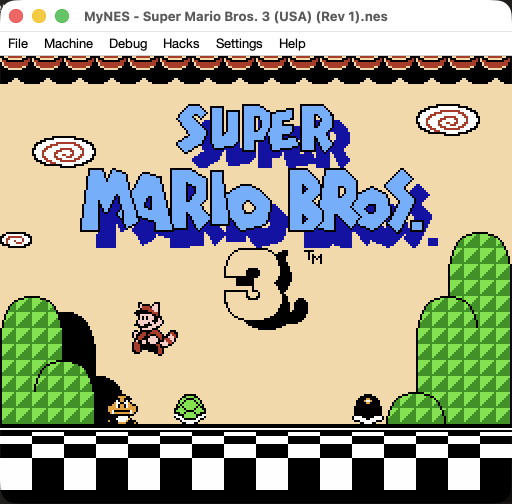
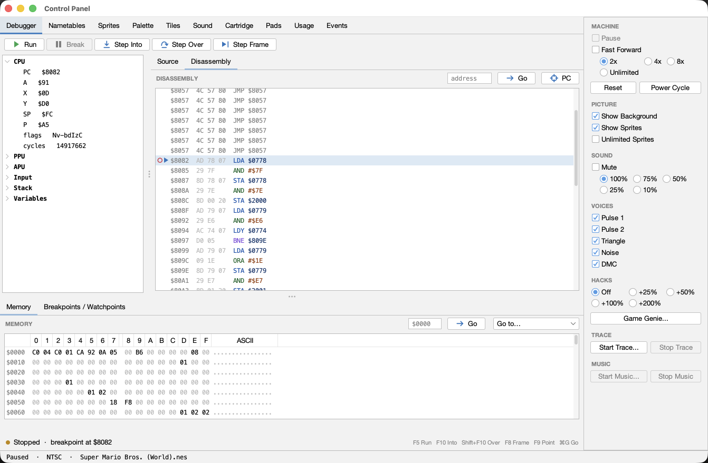
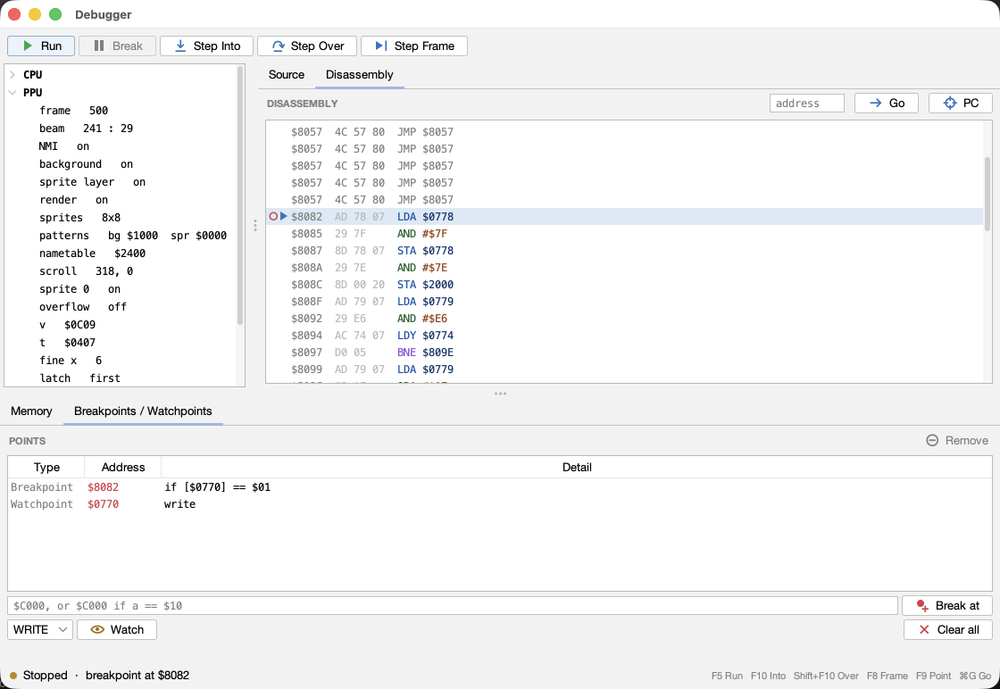
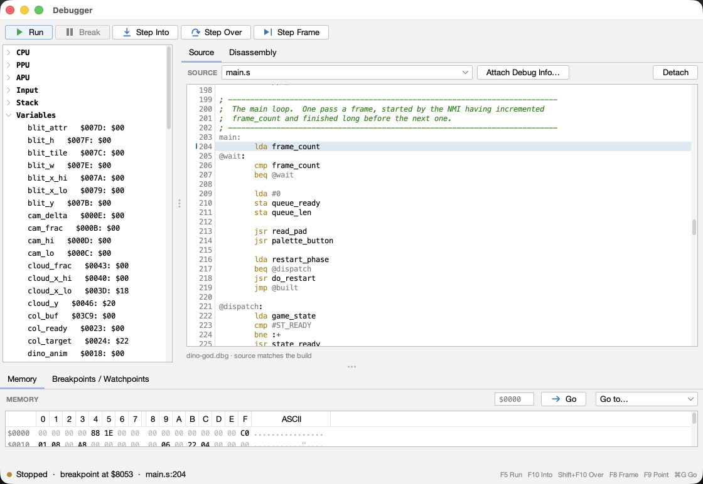
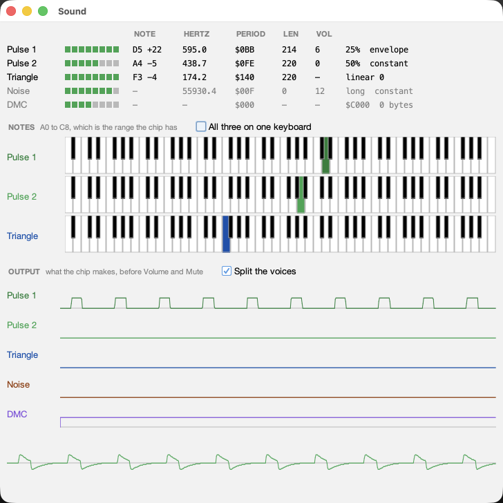
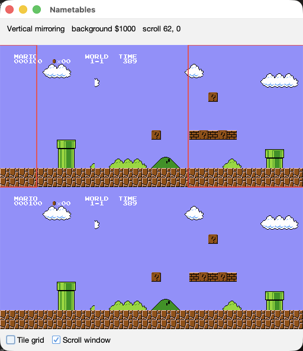
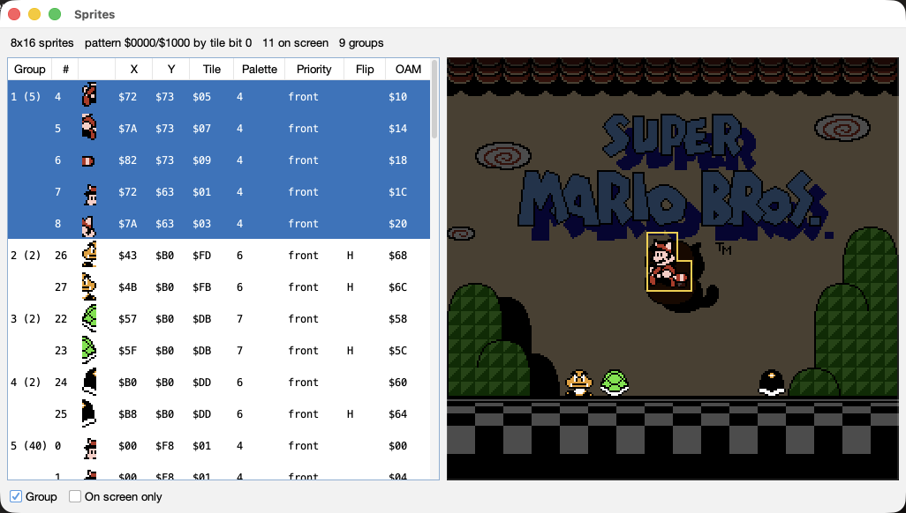
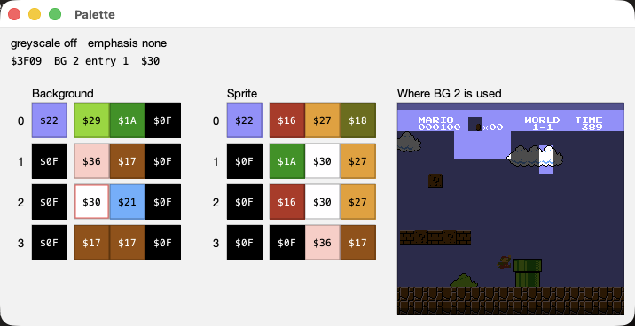
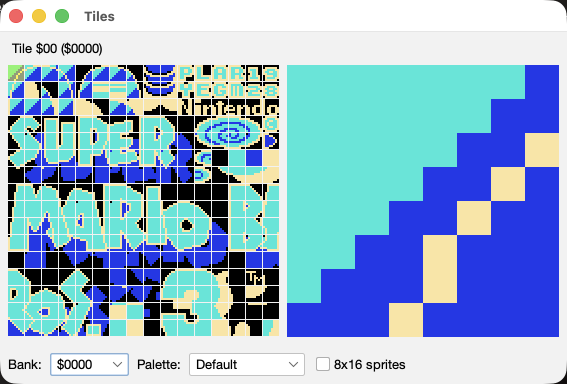

# MyNES

MyNES is a NES emulator written in Java. It runs on macOS, Windows, and Linux. It includes save states, rewind, video filters, and a debugger with source code, memory, and hardware views.



## Download

Download the latest archive from [Releases](https://github.com/dimiro1/mynes/releases) and unpack it. Java 25 is required; builds are available from [Adoptium](https://adoptium.net/).

Run `./mynes` on macOS or Linux, or `mynes.bat` on Windows. You can also run `java -jar mynes.jar` from the unpacked directory.

Open a `.nes` file or a `.zip` through **File > Open…**. Drag and drop also works. ROMs are not included.

## Playing

MyNES supports NTSC and PAL, iNES and NES 2.0, and twelve mapper families. If a game runs at the wrong speed, change the region under **Machine > Region**.

There are nine save state slots per game. F5 saves and F7 loads the current slot. Hold Backspace to rewind up to 30 seconds by default, including sound. Fast forward and movie recording are also available. Battery saves use standard `.sav` files.

Video options include twelve palettes, NTSC and CRT filters, overscan, and TV aspect ratio. You can mute each of the five audio channels. Optional hacks remove the sprite limit or reduce slowdown. IPS patches and Game Genie codes do not change the ROM file.

### Keys

| Action | Default key |
| :-- | :-- |
| D-pad | Arrow keys |
| A / B | X / Z |
| Start / Select | Enter / Shift |
| Quick save / load | F5 / F7 |
| Rewind | Hold Backspace |
| Full screen | F11; Esc to leave |
| Save / copy screenshot | F12 / Cmd or Ctrl+F12 |
| Volume up / down | Cmd or Ctrl+= / Cmd or Ctrl+- |
| Control Panel | Cmd or Ctrl+D |

Keys for both players can be changed under **Settings > Controller…**. Player two has no default keys. Gamepads and the Zapper are not supported yet.

## Debugging

Open **Debug > Control Panel** or press **Cmd/Ctrl+D**. The Debugger tab has source code or disassembly in the center. The tree on the left has CPU, PPU, APU, input, stack, and RAM values. Memory and breakpoints are below the code.



You can set conditional breakpoints and read or write watchpoints. The toolbar has Run, Break, Step Into, Step Over, and Step Frame. Register and memory values changed since the previous stop are highlighted.



For ca65/ld65 projects, attach the build's `.dbg` file in the Source tab. The debugger follows the current source line, shows symbols, and allows breakpoints in the source margin. These breakpoints keep their location when the cartridge switches PRG banks. Build with `ca65 -g` and `ld65 --dbgfile game.dbg` to generate the file.



The other Control Panel tabs show:

| Tab | Information |
| :-- | :-- |
| Nametables, Sprites, Palette, Tiles | PPU graphics data and on-screen use |
| Sound | Notes, levels, and waveforms for all five channels |
| Cartridge | Active PRG/CHR banks and mapper state |
| Pads | Held buttons and controller reads |
| Usage | CPU time used in recent frames |
| Events | Register writes and interrupts by scanline and dot |



The Control Panel also has CPU tracing and MIDI export.

## Screenshots

| | |
| :-- | :-- |
|  |  |
| **Nametables** | **Sprites** |
|  |  |
| **Palette** | **Tiles** |

More images: [NTSC filter](shots/filter-ntsc.png), [CRT filter](shots/filter-crt.png), [palette picker](shots/palette-dialog.png), [debugger](shots/debugger.png), [controller settings](shots/controller-dialog.png), and [Game Genie](shots/genie-dialog.png).

## Files and settings

Save states (`.mn1`–`.mn9`), battery saves (`.sav`), and movies (`.mnm`) are stored beside the ROM. For a ROM inside a ZIP, they are stored beside the ZIP and named after the ROM. Save states only work in MyNES. Raw `.sav` files can be used in other emulators.

Settings are stored in `~/.mynes/config.properties`. Most can also be changed in the menus. For example:

```properties
rewind.seconds=30
audio.latency-ms=60
```

## Headless mode

MyNES can run without a window:

```sh
java -jar mynes.jar --headless --rom game.nes --frames 900 \
    --input 60/40x3:start --screenshot 300,last --audio
```

Headless mode can save screenshots, audio, and a JSON report. `--expect-not-blank` and `--expect-audio` make checks return a failing exit code. `--interactive` provides a JSON command interface for stepping, breakpoints, watchpoints, traces, rewind, and movies. See `--headless --help` for all options.

## Build

Java 25 and Maven are required:

```sh
git clone https://github.com/dimiro1/mynes.git
cd mynes
mvn -q compile exec:exec
```

Run `mvn test` for the test suite. [CLAUDE.md](CLAUDE.md) has the design notes and detailed test results. Dendy mode is not supported yet.

## License

MIT. See [LICENSE](LICENSE).
